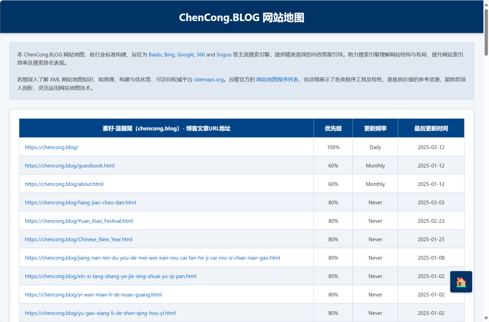

# Sitemap For Typecho

#### 介绍

它是 Typecho 网站的得力助手，能依据网站内容生成详细的指引地图。无论是网站运营者规划内容布局，还是用户在网站内查找信息，这一站点指引图都能凭借其独特的呈现方式，提供高效、清晰的引导，提升网站的可用性和用户体验。

#### 软件架构

“Typecho 站点脉络图” 旨在为 Typecho 网站提供精准、直观的站点地图生成服务。整体架构采用分层设计，以提高软件的可维护性、可扩展性和稳定性。主要分为数据采集层、数据处理层、地图生成层以及用户交互层。

#### 安装教程

1.  准备工作：搭建好 Typecho 网站，有管理权限，服务器支持 PHP（推荐 7.2+），开启pdo_mysql等必要扩展。
2.  从官方发布页面下载压缩包或用git clone克隆仓库。
3.  解压后将插件文件夹上传至/usr/plugins，登录后台在 “控制台 - 插件” 中启用，可按需配置规则。

#### 使用说明

登录 Typecho 网站后台，进入插件管理页面，点击 “Sitemap For Typecho” 插件对应的 “启用” 按钮。插件随即启动数据采集流程，依据既定规则生成站点地图。生成完成后，在插件管理页面会展示站点地图的链接，点击该链接可在浏览器中预览地图，同时可通过浏览器的 “另存为” 功能将站点地图下载至本地。运营者可借助站点地图清晰呈现的网站页面、文章之间的层次结构与关联关系，进行网站内容布局的规划与优化，如新增分类目录、合理调整文章所属分类等操作 。

#### 演示地址

https://chencong.blog/sitemap.xml

